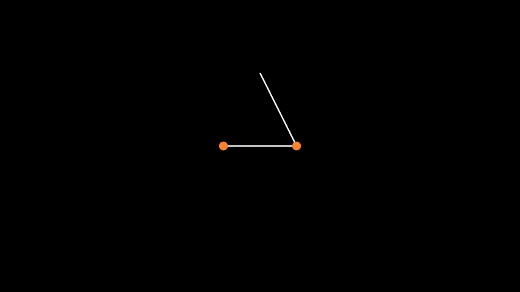

# manim-physics (Under Active Development)
## Introduction
This is a 2D physics simulation plugin that allows you to generate complicated scenes in various branches of Physics such as rigid mechanics, electromagnetism, wave etc.

Contributors: 
- [**pdcxs**](https://github.com/pdcxs)
- [**Matheart**](https://github.com/Matheart)
- [**icedcoffeeee**](https://github.com/icedcoffeeee)
## Contents
- [manim-physics (Under Active Development)](#manim-physics-under-active-development)
  - [Introduction](#introduction)
  - [Contents](#contents)
- [Installation](#installation)
- [Usage](#usage)
  - [Rigid Mechanics](#rigid-mechanics)
  - [Electromagnetism](#electromagnetism)
  - [Waves](#waves)
  - [Pendulums](#pendulums)
- [Contribution Guidelines](#contribution-guidelines)
- [Other beautiful animations based on manim-physics](#other-beautiful-animations-based-on-manim-physics)
- [Changelog](#changelog)
  - [**v0.2.3 2021.07.14**](#v023-20210714)
    - [Bugfixes](#bugfixes)
  - [**v0.2.2 2021.07.06**](#v022-20210706)
    - [New objects](#new-objects)
    - [Bugfixes](#bugfixes-1)
    - [Improvements](#improvements)
  - [**v0.2.1 2021.07.03**](#v021-20210703)
    - [New objects](#new-objects-1)
    - [Bugfixes](#bugfixes-2)
    - [Improvements](#improvements-1)
  - [**v0.2.0 2021.07.01**](#v020-20210701)
    - [Breaking Changes](#breaking-changes)
# Installation
`manim-physics` is a package on pypi, and can be directly installed using pip:
```
pip install manim-physics
```

**Warnings: Please do not directly clone the github repo! The repo is still under development and it is not a stable version, download manim-physics through pypi.**

# Usage
Make sure include these two imports at the top of the .py file
```py
from manim import *
from manim_physics import *
```
## Rigid Mechanics
Most objects can be made into a rigid body (moves according to gravity and collision) or a static body (stays still within the scene).

To use this feature, the `SpaceScene` must be used, to access the specific functions of the space.


>**NOTE**
>- This feature utilizes the pymunk package. Although unnecessary, it might make it easier if you knew a few things on how to use it.
>
>    [Official Documentation](http://www.pymunk.org/en/latest/pymunk.html)
>
>    [Youtube Tutorial](https://youtu.be/pRk---rdrbo)
>
>- A low frame rate might cause some objects to pass static objects as they don't register collisions finely enough. Trying to increase the config frame rate might solve the problem.

**Example**
```py
# use a SpaceScene to utilize all specific rigid-mechanics methods
class TwoObjectsFalling(SpaceScene):
    def construct(self):
        circle = Circle().shift(UP)
        circle.set_fill(RED, 1)
        circle.shift(DOWN + RIGHT)

        rect = Square().shift(UP)
        rect.rotate(PI / 4)
        rect.set_fill(YELLOW_A, 1)
        rect.shift(UP * 2)
        rect.scale(0.5)

        ground = Line([-4, -3.5, 0], [4, -3.5, 0])
        wall1 = Line([-4, -3.5, 0], [-4, 3.5, 0])
        wall2 = Line([4, -3.5, 0], [4, 3.5, 0])
        walls = VGroup(ground, wall1, wall2)
        self.add(walls)

        self.play(
            DrawBorderThenFill(circle),
            DrawBorderThenFill(rect),
        )
        self.make_rigid_body(rect, circle)  # Mobjects will move with gravity
        self.make_static_body(walls)  # Mobjects will stay in place
        self.wait(5)
        # during wait time, the circle and rect would move according to the simulate updater
```

## Electromagnetism
This section introduces new mobjects:
- Charge
- ElectricField
- Current
- CurrentMagneticField
- BarMagnet
- BarmagneticField
```py
class ElectricFieldExampleScene(Scene):
    def construct(self):
        charge1 = Charge(-1, LEFT + DOWN)
        charge2 = Charge(2, RIGHT + DOWN)
        charge3 = Charge(-1, UP)
        field = ElectricField(charge1, charge2, charge3)
        self.add(charge1, charge2, charge3)
        self.add(field)
```

```py
class MagnetismExample(Scene):
    def construct(self):
        current1 = Current(LEFT * 2.5)
        current2 = Current(RIGHT * 2.5, direction=IN)
        field = CurrentMagneticField(current1, current2)
        self.add(field, current1, current2)
```

```py
class BarMagnetExample(Scene):
    def construct(self):
        bar1 = BarMagnet().rotate(PI / 2).shift(LEFT * 3.5)
        bar2 = BarMagnet().rotate(PI / 2).shift(RIGHT * 3.5)
        self.add(BarMagneticField(bar1, bar2))
        self.add(bar1, bar2)
```

## Waves
This section introduces new wave mobjects into manim:
- LinearWave (3D) 
- RadialWave (3D) 
- StandingWave (2D) 

```py
class LinearWaveExampleScene(ThreeDScene):
    def construct(self):
        self.set_camera_orientation(60 * DEGREES, -45 * DEGREES)
        wave = LinearWave()
        self.add(wave)
        wave.start_wave()
        self.wait()
        wave.stop_wave()
```

```py
class RadialWaveExampleScene(ThreeDScene):
    def construct(self):
        self.set_camera_orientation(60 * DEGREES, -45 * DEGREES)
        wave = RadialWave(
            LEFT * 2 + DOWN * 5, # Two source of waves
            RIGHT * 2 + DOWN * 5,
            checkerboard_colors=[BLUE_D],
            stroke_width=0,
        )
        self.add(wave)
        wave.start_wave()
        self.wait()
        wave.stop_wave()
```

```py
class StandingWaveExample(Scene):
    def construct(self):
        wave1 = StandingWave(1)
        wave2 = StandingWave(2)
        wave3 = StandingWave(3)
        wave4 = StandingWave(4)
        waves = VGroup(wave1, wave2, wave3, wave4)
        waves.arrange(DOWN).move_to(ORIGIN)
        self.add(waves)
        for wave in waves:
            wave.start_wave()
        self.wait()
```

## Pendulums
`MultiPendulum` and `Pendulum` both stem from the [Rigid Mechanics](#rigid-mechanics) feature.
> **Note**:
>
> Sometimes the updaters lag behind the intended target. This may be solved by increasing config frame rate.
```py
class PendulumExample(SpaceScene):
    def construct(self):
        pends = VGroup(*[Pendulum(i) for i in np.linspace(1,5,7)])
        self.add(pends)
        for p in pends:
            self.make_rigid_body(p.bobs)
            p.start_swinging()
        self.wait(10)
```

```py
class MultiPendulumExample(SpaceScene):
    def construct(self):
        p = MultiPendulum(
            RIGHT, LEFT # positions of the bobs.
        )
        self.add(p)
        self.make_rigid_body(p.bobs) # make the bobs fall free.
        p.start_swinging() # attach them to their pivots.
        self.add(TracedPath(p.bobs[-1].get_center, stroke_color=BLUE))
        self.wait(10)
```

# Contribution Guidelines
The manim-physics plugin contains objects that are classified into **several main branches**, now including rigid mechanics simulation, electromagnetism and wave. 

If you want to add more objects to the plugin, The classes of the objects should be placed in the python file of corresponding branch, for example, `wave.py`, and place it under the folder src\manim_physics. The tests of objects should be named as `test_thefilename.py` such as `test_wave.py`, with some documentation, so the maintainer of this repo could ensure that it runs as expected.


# Other beautiful animations based on manim-physics


# Changelog
## **v0.2.3 2021.07.14**
### Bugfixes
- Fix the small arrow bug in `ElectricField`
## **v0.2.2 2021.07.06**
### New objects
- **Rigid Mechanics**: Pendulum
### Bugfixes
- Fix the `__all__` bug, now `rigid_mechanics.py` can run normally.
### Improvements
- Rewrite README.md to improve its readability

## **v0.2.1 2021.07.03**
### New objects
- **Electromagnetism**: Charge, ElectricField, Current, CurrentMagneticField, BarMagnet, and BarMagnetField
- **Wave**: LinearWave, RadialWave, StandingWave

### Bugfixes
- Fix typo

### Improvements
- Simplify rigid-mechanics

## **v0.2.0 2021.07.01**
### Breaking Changes
- Objects in the manim-physics plugin are classified into several **main branches** including rigid mechanics simulation, electromagnetism and wave.
